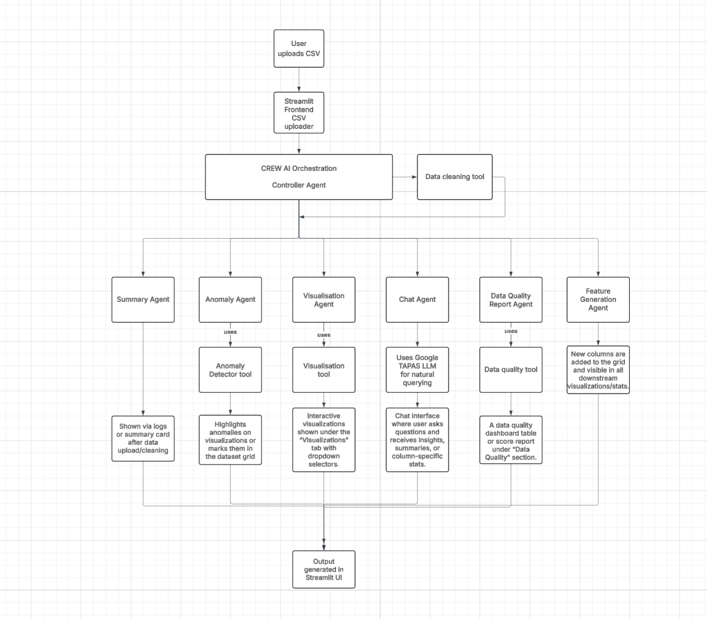

# 🚀 Smart Data Analyzer

**CrewAI Multi-Agent Data Analysis System**

A sophisticated data analysis platform powered by CrewAI's multi-agent framework, featuring specialized AI agents that collaborate to automatically clean, analyze, and visualize CSV data through an intuitive Streamlit interface.

## 🎯 System Architecture

![Architecture Overview]



The system employs **6 specialized AI agents** working in coordinated workflow:

### 🤖 AI Agents

| Agent | Role | Capabilities |
|-------|------|-------------|
| **🧠 Controller Agent** | Workflow Orchestrator | Task delegation, execution logging, memory management |
| **🧹 Data Cleaning Agent** | Preprocessing Specialist | Missing value imputation, type standardization, quality assurance |
| **📊 Statistics Agent** | Data Analyst | Descriptive statistics, correlation analysis, pattern identification |
| **📈 Visualization Agent** | Chart Specialist | Interactive Plotly charts, dashboard creation, drilldown exploration |
| **🚨 Anomaly Detection Agent** | Outlier Hunter | Z-score analysis, Isolation Forest, anomaly flagging |
| **💬 Chat Agent** | Query Interface | Natural language querying via Google TAPAS model |

### ⚙️ Additional Components
- **➕ Feature Generation Agent** - Dynamic feature engineering with mathematical operations
- **📋 Data Quality Agent** - Comprehensive quality assessment and reporting
- **🧪 Interactive Playground** - Real-time data exploration with AgGrid

## 🛠️ Technology Stack

- **🤖 CrewAI** - Multi-agent orchestration framework
- **🖥️ Streamlit** - Interactive web interface with dark theme
- **🧠 TAPAS** - Google's table question-answering model
- **📊 Plotly** - Interactive data visualizations  
- **🐼 Pandas** - Data manipulation and analysis
- **📋 AgGrid** - Interactive data tables with filtering
- **🔬 Scikit-learn** - Machine learning for anomaly detection

## 🚀 Quick Start

### Prerequisites
```bash
Python 3.8+
pip install -r requirements.txt
```

### Installation
```bash
git clone https://github.com/ManishKondoju/AgenticSystem.git
cd AgenticSystem
pip install -r requirements.txt
```

### Run Application
```bash
streamlit run dashboard.py
```

## 📊 Features

### 🔄 Automated Data Pipeline
- **Intelligent Data Cleaning** - Automated preprocessing with missing value handling
- **Statistical Analysis** - Comprehensive descriptive statistics and correlations
- **Interactive Visualizations** - Multiple chart types with real-time generation
- **Anomaly Detection** - ML-powered outlier identification
- **Quality Assessment** - Detailed data quality metrics and reporting

### 💬 Natural Language Interface
- **TAPAS Integration** - Advanced table question-answering
- **Context-Aware Responses** - Intelligent query processing
- **Conversational Analytics** - Ask questions in plain English

### 🎨 User Experience
- **Dark Theme Interface** - Professional Streamlit styling with flip card animations
- **Interactive Playground** - Real-time data exploration and manipulation
- **Dynamic Feature Generation** - Create mathematical and temporal features on-demand
- **Comprehensive Error Handling** - Robust fallback strategies

## 🏗️ Project Structure

```
smart_data_analyzer/
├── agents/
│   ├── controller_agent.py      # CrewAI orchestration
│   ├── chat_agent.py           # TAPAS natural language interface
│   ├── stats_agent.py          # Statistical analysis
│   ├── visualization_agent.py  # Chart generation
│   ├── anomaly_agent.py        # Outlier detection
│   ├── data_quality_agent.py   # Quality assessment
│   └── feature_generation_agent.py # Custom feature engineering
├── tools/
│   └── data_cleaning_tool.py   # Data preprocessing utilities
├── dashboard.py                # Main Streamlit application
├── requirements.txt           # Python dependencies
└── README.md                 # Project documentation
```


### Key Demo Features
- CrewAI multi-agent workflow in action
- Real-time data processing and analysis
- Interactive TAPAS-powered chat interface
- Custom feature generation capabilities
- Professional UI with smooth animations


### Model Requirements
- **TAPAS Model**: Downloads automatically on first run (~1.5GB)
- **Internet Connection**: Required for initial model download

## 📈 Use Cases

- **Business Analytics** - Quick insights from sales, customer, or operational data
- **Data Exploration** - Interactive analysis of unknown datasets
- **Quality Assessment** - Comprehensive data validation and cleaning
- **Feature Engineering** - Dynamic creation of derived variables
- **Conversational Analytics** - Natural language data querying


## 📄 License

This project is licensed under the MIT License - see the [LICENSE](LICENSE) file for details.

## 🙏 Acknowledgments

- **CrewAI** - Multi-agent framework
- **Google TAPAS** - Table question-answering model
- **Streamlit** - Web application framework
- **Plotly** - Interactive visualization library

---

**Built with ❤️ using CrewAI Multi-Agent Architecture**